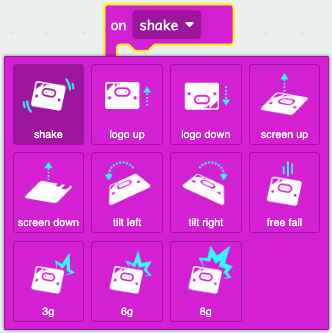

You can find the `on shake`{:class='microbitinput'} block in the `Input`{:class='microbitinput'} menu in your Toolbox.

```microbit
input.onGesture(Gesture.Shake, function () {
	
})
```

Here are the gestures you can use.


