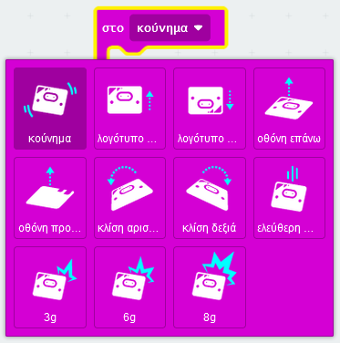

Μπορείς να βρεις το μπλοκ `στο κούνημα`{:class='microbitinput'} στο μενού 'Είσοδος\`{:class='microbitinput'} στην Εργαλειοθήκη σου.

```microbit
input.onGesture(Gesture.Shake, function () {
	
})
```

Αυτές είναι οι χειρονομίες που μπορείς να χρησιμοποιήσεις.


