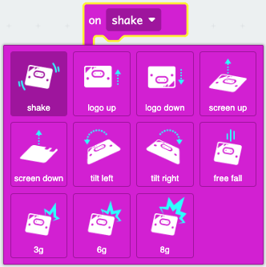

You can find the `on shake`{:class='microbitinput'} block in the `Input`{:class='microbitinput'} menu in your Toolbox.

<iframe style="position:relative;top:0;left:0;width:50%;height:100%;" src="https://makecode.microbit.org/---codeembed#pub:_Wff4v7MYXLrR" allowfullscreen="allowfullscreen" frameborder="0" sandbox="allow-scripts allow-same-origin"></iframe>

Here are the gestures you can use.

