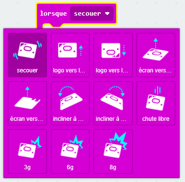

Tu peux trouver le bloc `secouer`{:class='microbitinput'} dans le menu `Entrée`{:class='microbitinput'} dans ta boîte à outils.

```microbit
input.onGesture(Gesture.Shake, function () {
	
})
```

Voici les gestes que tu peux utiliser.



