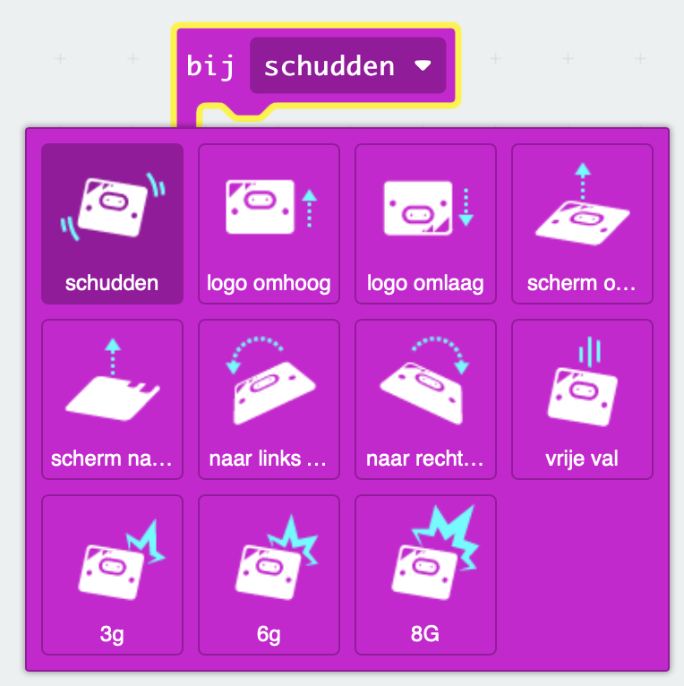

Je kunt het blok `bij schudden`{:class='microbitinput'} vinden in het menu `Invoer`{:class='microbitinput'} in je Toolbox.

```microbit
input.onGesture(Gesture.Shake, function () {
	
})
```

Hier zijn de gebaren die je kunt gebruiken.


